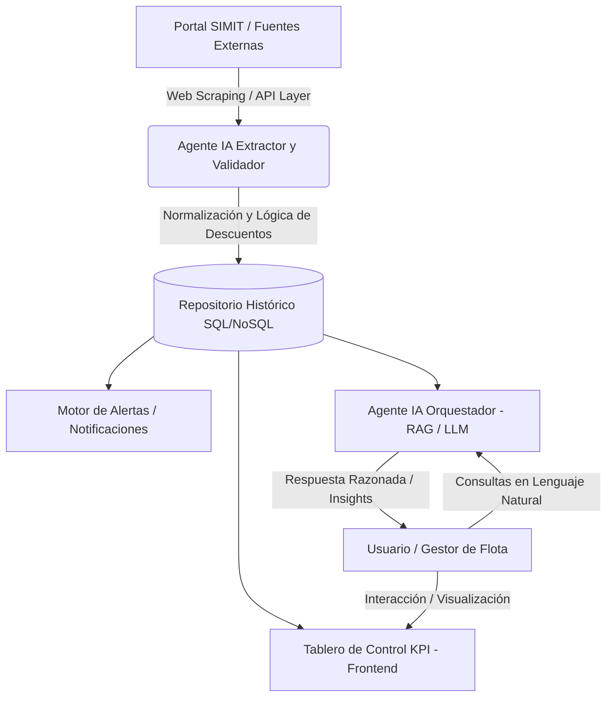

# Automatización Inteligente para la Gestión y Seguimiento Preventivo de Infracciones de Tránsito en Flotas Vehiculares Corporativas

**Propuesta de Trabajo de Grado - Maestría en Inteligencia Artificial**  
**Autor:** Samir Enrique Bolívar Barrios  
**Contacto:** +57 311 741 5122 | samir.bolivar@unisimon.edu.co  
**Institución:** Universidad Simón Bolívar  

---

## Ficha Resumen del Proyecto

| Parámetro | Detalle |
| :--- | :--- |
| **Título del Proyecto** | Automatización inteligente para la gestión y seguimiento preventivo de infracciones de tránsito en flotas vehiculares corporativas |
| **Autor** | Samir Enrique Bolívar Barrios |
| **Programa** | Maestría en Inteligencia Artificial |
| **Área de Conocimiento** | Agentes Inteligentes, Procesamiento de Lenguaje Natural (NLP), Automatización de Procesos (RPA+IA), Sistemas Multiagente |
| **Objeto de Estudio** | Automatización de procesos administrativos y gestión proactiva de datos gubernamentales heterogéneos mediante sistemas inteligentes |

---

## 1. Breve Descripción de la Idea de Investigación

La investigación propone el desarrollo de un **sistema automatizado e inteligente** para la consulta diaria, extracción y validación de comparendos desde el portal **SIMIT** (Sistema Integrado de Información sobre Multas y Sanciones por Infracciones de Tránsito), asociados a la identificación tributaria (NIT) de la flota vehicular corporativa.

El sistema sustituirá la transcripción manual mensual por un flujo automatizado de **actualización diaria**, integrando toda la lógica de negocio en una **plataforma web integral** que incluye:
* Cálculo dinámico de vigencia de descuentos de ley.
* Creación y automatización de alertas omnicanal / correo electrónico.
* Visualizaciones interactivas de KPIs estratégicos para toma de decisiones.
* **Agente de IA Orquestador** con capacidades de razonamiento lógico y procesamiento de lenguaje natural (NLP/RAG), diseñado para responder consultas complejas en lenguaje natural sobre el histórico de infracciones de la flota.

---

## 2. Propósito

Desarrollar una solución tecnológica basada en inteligencia artificial que garantice la **visibilidad diaria** de la situación de comparendos de la flota vehicular corporativa, permitiendo a la organización anticipar pagos, maximizar el aprovechamiento de descuentos legales de ley (oportunidad de términos) y optimizar los recursos financieros y operativos.

---

## 3. Finalidad

Transformar la gestión reactiva e ineficiente de infracciones en un **proceso preventivo, sistemático y automatizado** que asegure la integridad y trazabilidad de la información, minimizando sobrecostos por mora, pérdida de términos legales o procesos de cobro coactivo.

---

## 4. Producto (Entregable del Proyecto)

Una plataforma web constituida por:
1. **Agente IA Extractor / Validador:** Encargado de la extracción, parseo y validación diaria de comparendos desde el portal SIMIT para la flota corporativa.
2. **Repositorio Histórico de Infracciones:** Base de datos estructurada con trazabilidad completa de comparendos, estados, términos de descuento y pagos.
3. **Tablero Analítico (Dashboard KPI):** Interfaz visual interactiva con indicadores estratégicos de la flota (tasa de infracciones, costos por fotodetecciones, ahorros por descuentos capturados, vehículos reincidentes).
4. **Agente IA Orquestador (Reasoning & QA Agent):** Agente con capacidades de razonamiento lógico y procesamiento de lenguaje natural, diseñado para resolver consultas complejas de los gestores en lenguaje natural sobre el estado de la flota.

---

## 5. Planteamiento del Problema

### Contexto y Problemática Actual
Actualmente, la compañía realiza la consulta y consolidación de comparendos de manera **manual y con una periodicidad mensual**, debido a la alta complejidad y volumen de registros asociados al NIT de la flota vehicular.

### Efectos y Consecuencias
* **Brecha Informativa:** La consulta mensual genera una desactualización de hasta 30 días, impidiendo detectar infracciones nuevas oportunamente.
* **Pérdida de Descuentos Legales:** Frecuentemente se pierden los beneficios económicos y descuentos otorgados por la ley por no tener conocimiento previo del comparendo antes de su vencimiento.
* **Error Humano:** Proceso propenso a errores de transcripción, omitiendo vehículos o registrando valores erróneos.
* **Perjuicio Económico y Operativo:** Pago de intereses de mora, riesgo de embargos o cobro coactivo, e ineficiencia administrativa generalizada.

---

## 6. Objeto de Estudio

La **automatización de procesos administrativos y la gestión proactiva de datos gubernamentales heterogéneos mediante sistemas inteligentes** (Agentes de IA, Arquitecturas RAG / LLM y visualización analítica).

---

## 7. Justificación

La optimización en la administración de las obligaciones de tránsito dentro de flotas vehiculares corporativas ha evolucionado de ser una labor meramente administrativa a constituirse en un pilar crítico para la estabilidad financiera y la continuidad operativa institucional. En la realidad operativa actual, caracterizada por un entorno de vigilancia tecnológica persistente mediante sistemas de fotodetección masiva, la permanencia de modelos de consulta manuales representa una vulnerabilidad insostenible para el presupuesto organizacional.

### Dimensiones de Justificación:

1. **Dimensión Económica y Operativa:**
   Erradica la brecha informativa que imposibilita el aprovechamiento de beneficios de ley y expone a la entidad a riesgos de parálisis administrativa y cobros coactivos.

2. **Dimensión Teórica:**
   Aporta al estudio de la integración de procesos mediante **agentes de Inteligencia Artificial** y automatización inteligente de flujos de trabajo en entornos corporativos de alta complejidad.

3. **Dimensión Metodológica:**
   Propone un **modelo original de extracción y validación de datos no estructurados/semiestructurados** desde plataformas gubernamentales (SIMIT), altamente replicable en otras áreas administrativas que requieran consumo de fuentes masivas externas.

4. **Dimensión Práctica:**
   Elimina el riesgo permanente de error humano en transcripciones, ofreciendo un seguimiento diario automatizado que asegura la salud financiera organizacional mediante el aprovechamiento sistemático de descuentos legales.

5. **Dimensión Social y Humana:**
   Revaloriza la labor del analista corporativo. Libera al talento humano de tareas mecánicas, repetitivas y tediosas, permitiéndole enfocar sus capacidades cognitivas superiores en el **razonamiento lógico y el análisis estratégico de datos**.

---

## 8. Formulación del Problema y Preguntas de Investigación

### Pregunta General
¿Cómo puede desarrollarse un modelo de automatización inteligente basado en agentes de IA que transforme la gestión de infracciones de tránsito en flotas vehiculares corporativas en un proceso proactivo, exacto y eficiente?

### Preguntas Específicas
1. ¿Cómo se caracterizan los procesos actuales de consulta en el portal SIMIT y cuáles son los requerimientos técnicos necesarios para garantizar la visibilidad diaria y la gestión proactiva de la flota?
2. ¿Cuáles son las especificaciones de diseño y las capacidades de razonamiento lógico que debe integrar el agente de IA para asegurar la extracción, validación y actualización dinámica del repositorio histórico de infracciones?
3. ¿De qué manera debe estructurarse la plataforma web y cómo debe operar el agente orquestador para permitir la resolución eficiente de consultas en lenguaje natural sobre el estado de los vehículos?

---

## 9. Objetivos

### Objetivo General
Desarrollar un modelo de automatización inteligente basado en agentes de IA para la gestión proactiva y el análisis histórico de infracciones de tránsito en entornos de flotas vehiculares corporativas.

### Objetivos Específicos
1. **Caracterizar** los procesos actuales de consulta en el portal SIMIT junto con los requerimientos técnicos necesarios para la gestión proactiva de la flota.
2. **Diseñar** un agente de IA con capacidades de razonamiento lógico para la extracción, validación y actualización dinámica de registros en un repositorio histórico de infracciones vehiculares.
3. **Implementar** una plataforma web integrada con un agente orquestador para la resolución de consultas en lenguaje natural sobre el estado de los vehículos.

---

## 10. Arquitectura Técnica Propuesta (Visión de Ingeniería en IA)

### Componentes Clave:
* **Agente Extractor & Validador (RPA + Python):** Tarea programada (Cron/Job diario) para scrapping/query automatizado al SIMIT.
* **Base de Datos Histórica:** Almacenamiento con esquemas para vehículos, comparendos, fotodetecciones, fechas límite de descuento y estados.
* **Agente Orquestador & Razonamiento (LLM / RAG):** Integración de modelos de lenguaje (Gemini / OpenAI API / LangChain / LlamaIndex) con herramientas (Function Calling / Text-to-SQL) para consultar la BD y responder preguntas complejas (ej. *"¿Qué vehículos tienen comparendos próximos a vencer con descuento del 50% en los próximos 3 días?"*).
* **Frontend Web & Dashboard Analytics:** Interfaz moderna en HTML/JS/React con gráficos dinámicos y chat conversacional.

---

## 11. Hitos y Próximos Pasos para el Desarrollo del Prototipo

1. **Fase 1: Análisis y Levantamiento de Requerimientos** (Caracterización SIMIT y Estructuración del Dominio de Datos).
2. **Fase 2: Arquitectura de Datos y Agente Extractor** (Scraper / API Parser SIMIT y BD Relacional).
3. **Fase 3: Agente Orquestador y Motor de Razonamiento IA** (Modelos LLM, Prompt Engineering, Text-to-SQL / RAG).
4. **Fase 4: Desarrollo de la Plataforma Web y Dashboard KPI** (UI/UX, Paneles analíticos y Módulo de Chat IA).
5. **Fase 5: Pruebas, Validación y Evaluación de Impacto** (Pruebas de exactitud, reducción de errores y métricas de rendimiento).
